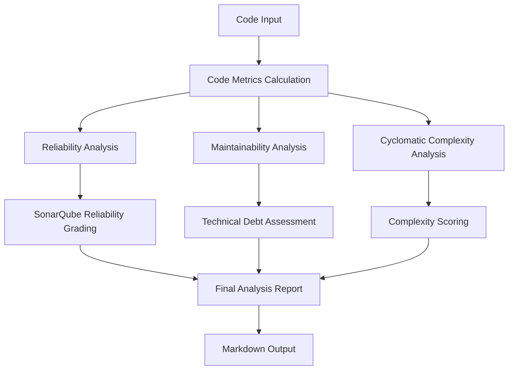

# Code Alchemist AI Forge - Technical Documentation

## 📋 Table of Contents

1. [System Overview](./system-overview.md)
2. [Architecture & Design](./architecture.md)
3. [Core Modules Documentation](./core-modules.md)
4. [Grading System](./grading-system.md)
5. [Process Flow](./process-flow.md)
6. [API Reference](./api-reference.md)
7. [Testing Strategy](./testing-strategy.md)
8. [Limitations & Known Issues](./limitations.md)
9. [Future Considerations](./future-considerations.md)

## 🎯 Quick Start

This documentation provides a comprehensive technical reference for the Code Alchemist AI Forge code quality analysis system. The system performs static code analysis using SonarQube-style methodologies to evaluate:

- **Reliability**: Bug detection, crash-prone patterns, exception handling
- **Maintainability**: Technical debt, code complexity, structure quality
- **Cyclomatic Complexity**: Control flow analysis, decision point counting

## 🏗️ System Architecture

## 📖 Documentation Structure

Each section of this documentation covers specific aspects:

- **System Overview**: High-level purpose, objectives, and technology stack
- **Architecture**: Detailed system design, component interactions, data flow
- **Core Modules**: In-depth analysis of each module's functionality and algorithms
- **Grading System**: Comprehensive explanation of scoring methodologies
- **Process Flow**: Step-by-step analysis workflow from input to output
- **API Reference**: Function signatures, parameters, and return types
- **Testing**: Current testing approach and validation strategies
- **Limitations**: Known issues, edge cases, and technical debt
- **Future**: Planned improvements and enhancement opportunities

## 🔗 Repository Information

- **GitHub**: https://github.com/mandarborkar2304/code-alchemist-ai-forge
- **Primary Language**: TypeScript
- **Frontend Framework**: React with Vite
- **Styling**: Tailwind CSS
- **UI Components**: Shadcn UI

---

*This documentation is maintained alongside the codebase and should be updated whenever significant changes are made to the analysis algorithms or system architecture.*
