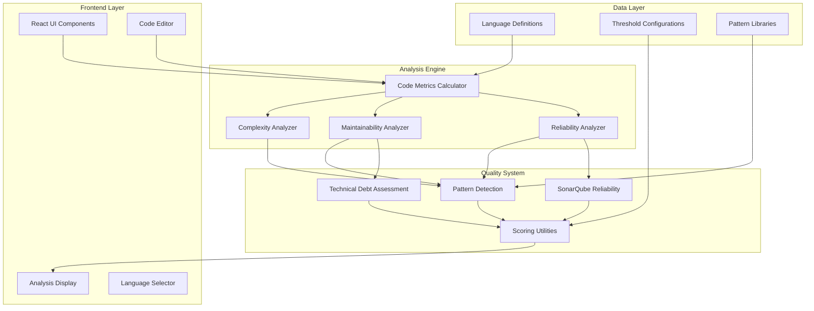
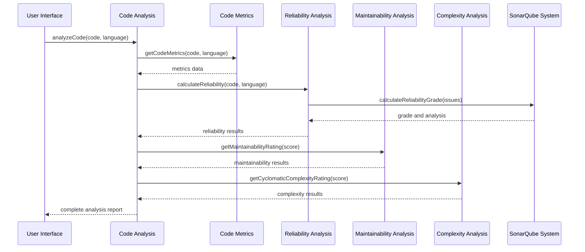
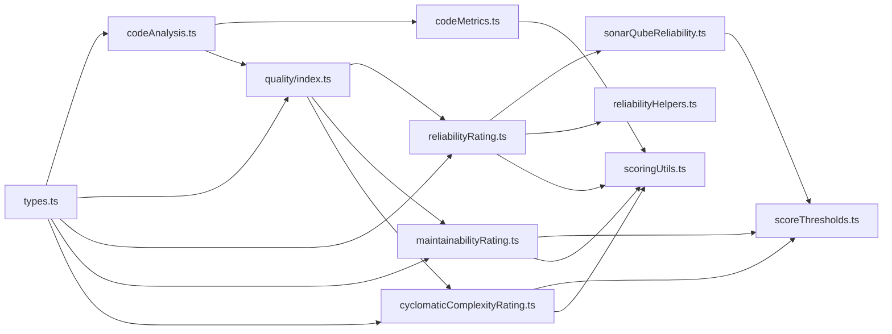

# Architecture & Design

## 🏗️ System Architecture

The Code Alchemist AI Forge follows a modular, layered architecture designed for maintainability, extensibility, and clear separation of concerns.

### High-Level Architecture Diagram



## 📁 Folder Structure

```
src/
├── components/              # React UI Components
│   ├── ui/                 # Shadcn UI Components
│   ├── CodeEditor.tsx      # Main code input interface
│   ├── AnalysisPanel.tsx   # Results display
│   ├── CodeQualityMeter.tsx # Visual quality indicators
│   └── ...                 # Other UI components
├── utils/                  # Core Business Logic
│   ├── quality/           # Quality Analysis Modules
│   │   ├── index.ts       # Main exports and coordination
│   │   ├── types.ts       # TypeScript type definitions
│   │   ├── scoreThresholds.ts # Grading thresholds and constants
│   │   ├── reliabilityRating.ts # Reliability analysis
│   │   ├── maintainabilityRating.ts # Maintainability analysis
│   │   ├── cyclomaticComplexityRating.ts # Complexity analysis
│   │   ├── sonarQubeReliability.ts # SonarQube methodology
│   │   ├── reliabilityHelpers.ts # Utility functions
│   │   └── scoringUtils.ts # Common scoring utilities
│   ├── codeMetrics.ts     # Core metrics calculation
│   ├── codeAnalysis.ts    # Analysis orchestration
│   └── codeQualityRatings.ts # Legacy compatibility layer
├── data/                  # Static Data
│   └── languages.ts       # Supported language definitions
├── types/                 # Type Definitions
│   └── index.ts          # Global TypeScript types
├── hooks/                 # React Custom Hooks
├── pages/                 # Page Components
└── lib/                  # Utility Libraries
```

## 🔄 Component Interactions

### Analysis Flow Architecture



### Data Flow Patterns

#### 1. Input Processing
```
User Code → Language Detection → Syntax Validation → Metric Extraction
```

#### 2. Analysis Pipeline
```
Raw Metrics → Pattern Detection → Rule Application → Score Calculation → Grade Assignment
```

#### 3. Result Aggregation
```
Individual Scores → Weighted Combination → Final Grade → Report Generation
```

## 🧩 Module Relationships

### Core Dependencies



### Interface Contracts

#### Core Analysis Interface
```typescript
interface AnalysisResult {
  reliability: ScoreData;
  maintainability: ScoreData;
  cyclomaticComplexity: ScoreData;
  metrics: MetricsResult;
  summary: AnalysisSummary;
}
```

#### Scoring Interface
```typescript
interface ScoreData {
  score: ScoreGrade; // 'A' | 'B' | 'C' | 'D'
  description: string;
  reason: string;
  issues?: string[] | ReliabilityIssue[];
  improvements?: string[];
  warningFlag?: boolean;
}
```

## 🔧 Design Patterns

### 1. Strategy Pattern
Used for different analysis algorithms:
```typescript
// Quality analysis strategies
export function getRatingFromScore(
  score: number, 
  category: 'reliability' | 'cyclomaticComplexity' | 'maintainability'
): ScoreData {
  switch (category) {
    case 'reliability': return getReliabilityRating(score);
    case 'cyclomaticComplexity': return getCyclomaticComplexityRating(score);
    case 'maintainability': return getMaintainabilityRating(score);
  }
}
```

### 2. Factory Pattern
Language-specific analysis configuration:
```typescript
// Language-specific comment patterns
function getCommentSyntax(language: string): string {
  const syntaxMap = {
    javascript: '//',
    python: '#',
    java: '//',
    // ...
  };
  return syntaxMap[language.toLowerCase()] || '//';
}
```

### 3. Observer Pattern
UI components react to analysis state changes through React hooks and state management.

### 4. Template Method Pattern
Common analysis workflow with language-specific implementations:
```typescript
export const calculateCyclomaticComplexity = (code: string, language: string): number => {
  // Template method with language-specific rules
  const baseComplexity = 1;
  const languageRules = getLanguageRules(language);
  return analyzeWithRules(code, languageRules, baseComplexity);
};
```

## 🏢 Architectural Principles

### 1. Separation of Concerns
- **UI Layer**: React components handle presentation only
- **Business Logic**: Utils handle analysis and computation
- **Data Layer**: Separate configuration and type definitions

### 2. Single Responsibility
Each module has a focused responsibility:
- `codeMetrics.ts`: Raw metric calculation
- `reliabilityRating.ts`: Reliability-specific analysis
- `sonarQubeReliability.ts`: SonarQube methodology implementation

### 3. Open/Closed Principle
- Easy to add new languages without modifying existing code
- New analysis rules can be added through configuration
- Extensible grading systems

### 4. Dependency Inversion
- High-level modules don't depend on low-level modules
- Both depend on abstractions (TypeScript interfaces)
- Allows for easy testing and mocking

## 🔄 Configuration Architecture

### Threshold Management
```typescript
// Centralized configuration
export const SONARQUBE_GRADE_THRESHOLDS = {
  A: { blocker: 0, critical: 0, major: 0, minor: 5 },
  B: { blocker: 0, critical: 0, major: 2, minor: 10 },
  C: { blocker: 0, critical: 1, major: 5, minor: 20 },
  D: { blocker: 1, critical: 2, major: 10, minor: 50 }
} as const;
```

### Pattern Libraries
```typescript
// Extensible pattern definitions
export const CRITICAL_PATTERNS = [
  'null pointer', 'divide by zero', 'buffer overflow',
  // ... additional patterns
] as const;
```

## 🎯 Scalability Considerations

### Horizontal Scaling
- Stateless analysis functions enable easy parallelization
- Each analysis runs independently
- No shared mutable state between analyses

### Vertical Scaling
- Memory-efficient string processing
- Lazy evaluation where possible
- Streaming analysis for large files

### Performance Optimizations
- Compiled regular expressions cached for reuse
- Early termination for definitive results
- Incremental analysis for iterative improvements

## 🔒 Error Handling Architecture

### Graceful Degradation
```typescript
// Defensive programming patterns
if (!isFinite(score) || score < 0) {
  console.warn('Invalid score provided:', score);
  return getDefaultGrade();
}
```

### Error Boundaries
- UI components wrapped with error boundaries
- Analysis failures don't crash the entire application
- Meaningful error messages for users

### Validation Layers
- Input validation at UI level
- Business logic validation in analysis functions
- Type safety through TypeScript

This architecture ensures maintainability, extensibility, and robustness while providing clear separation of concerns and enabling future enhancements.
