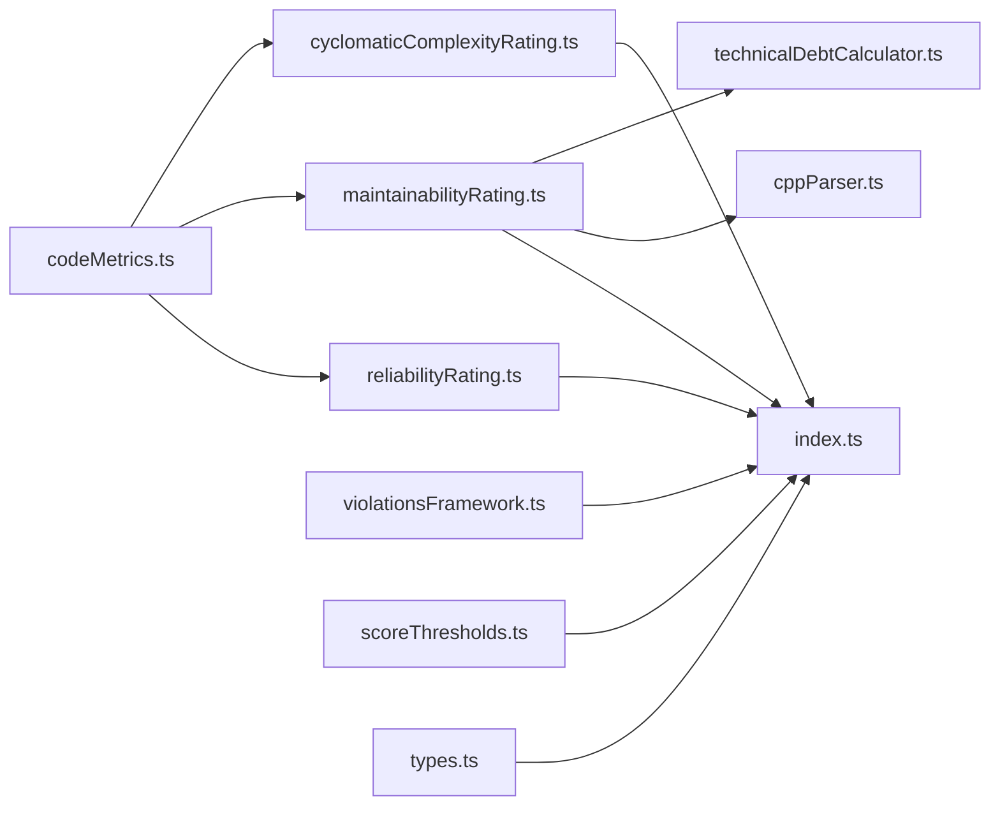

# Core Modules Documentation

## Overview

This document provides detailed information about each core module in the Code Quality Analysis System, including their enhanced capabilities for technical debt calculation, SonarQube alignment, and advanced language support.

## Module Architecture



## Enhanced Core Modules

### 1. technicalDebtCalculator.ts

**Purpose**: Advanced technical debt calculation with SonarQube methodology alignment

#### Key Features
- **Remediation Time Estimation**: Precise time estimates for different issue types
- **Severity Classification**: Minor, Major, Critical severity levels
- **Context-Aware Analysis**: Different rules for test files, utilities, generated code
- **Comprehensive Issue Detection**: 7 different debt source categories

#### Input Structure
```typescript
constructor(
  code: string,           // Source code to analyze
  language: string,       // Programming language
  codeLines: number      // Estimated lines of code
)
```

#### Output Structure
```typescript
interface TechnicalDebtResult {
  totalDebtMinutes: number;    // Total remediation time
  debtRatio: number;           // Percentage of development time
  grade: ScoreGrade;           // A, B, C, or D
  issues: DebtIssue[];         // Detailed issue list
  codeSmells: number;          // Total number of issues
}
```

#### Core Logic
1. **Function Size Analysis**: Detects oversized functions using language-specific patterns
2. **Nesting Complexity**: Tracks control structure depth with proper scope management
3. **Code Duplication**: Identifies duplicated blocks using content-based hashing
4. **Documentation Coverage**: Analyzes comment density and quality
5. **Complexity Assessment**: Function-level cyclomatic complexity evaluation
6. **Naming Conventions**: Consistency checking across identifiers
7. **Structural Issues**: Dead code, empty catch blocks, unreachable code

#### Example Usage
```typescript
const calculator = new TechnicalDebtCalculator(sourceCode, 'typescript', 150);
const result = calculator.calculateTechnicalDebt();

console.log(`Technical Debt: ${result.totalDebtMinutes} minutes`);
console.log(`Debt Ratio: ${result.debtRatio}%`);
console.log(`Code Smells: ${result.codeSmells}`);
```

### 2. cppParser.ts

**Purpose**: Advanced C++ source code parsing and analysis

#### Key Features
- **AST-like Parsing**: Sophisticated C++ syntax recognition
- **Class Hierarchy Analysis**: Inheritance tracking and virtual method detection
- **Function Metadata Extraction**: Return types, parameters, modifiers
- **Memory Management Analysis**: Resource allocation pattern detection
- **Template Support**: Basic template syntax handling

#### Input Structure
```typescript
constructor(code: string)
```

#### Output Structure
```typescript
interface CppParseResult {
  functions: CppFunction[];     // All detected functions
  classes: CppClass[];         // Class definitions and hierarchies
  namespaces: string[];        // Namespace declarations
  includes: string[];          // Include dependencies
  complexity: number;          // Overall file complexity
}
```

#### Parsing Capabilities

##### Function Detection Patterns
```cpp
// Standard functions
returnType functionName(parameters)

// Class methods with access levels
class MyClass {
public:
    void publicMethod();
private:
    static int privateStaticMethod();
    virtual void virtualMethod() = 0;
};

// Constructors and destructors
MyClass(int param);
virtual ~MyClass();

// Operator overloads
MyClass operator+(const MyClass& other);
```

##### Class Analysis Features
- **Inheritance Tracking**: Base class identification
- **Virtual Method Detection**: Pure virtual and virtual method recognition
- **Access Level Management**: public/private/protected scope tracking
- **Member Variable Extraction**: Data member identification

#### C++ Specific Quality Checks
1. **Virtual Destructor Validation**: Ensures polymorphic classes have virtual destructors
2. **Memory Leak Detection**: Identifies potential resource management issues
3. **RAII Compliance**: Analyzes resource acquisition patterns

#### Example Usage
```typescript
const parser = new CppParser(cppSourceCode);
const result = parser.parse();

console.log(`Functions found: ${result.functions.length}`);
console.log(`Classes found: ${result.classes.length}`);
console.log(`Virtual functions: ${result.functions.filter(f => f.isVirtual).length}`);
```

### 3. maintainabilityRating.ts (Enhanced)

**Purpose**: Comprehensive maintainability analysis with technical debt integration

#### Enhanced Features
- **Technical Debt Integration**: Uses TechnicalDebtCalculator for realistic assessments
- **Language-Specific Analysis**: Enhanced C++ support via CppParser
- **Context-Aware Grading**: Different thresholds for different file types
- **Detailed Issue Reporting**: Breakdown by issue type and severity

#### Function Signature
```typescript
function getMaintainabilityRating(
  score: number,                    // Legacy compatibility score
  actualDuplicationPercent?: number, // Optional duplication data
  context?: string,                 // File context/path
  code?: string,                    // Actual source code
  language?: string                 // Programming language
): ScoreData
```

#### Analysis Flow
1. **Input Validation**: Ensures valid parameters
2. **Mode Selection**: Enhanced vs. Legacy analysis based on available data
3. **Language Detection**: Specialized handling for C++, Java, JavaScript/TypeScript
4. **Technical Debt Calculation**: Comprehensive debt analysis
5. **Grade Assignment**: SonarQube-aligned grade calculation
6. **Report Generation**: Detailed description with actionable improvements

#### Enhanced Output Structure
```typescript
interface ScoreData {
  score: ScoreGrade;              // A, B, C, D grade
  description: string;            // Human-readable description
  reason: string;                 // Detailed reasoning
  issues: string[];              // List of identified issues
  improvements: string[];        // Actionable improvement suggestions
  warningFlag?: boolean;         // Indicates urgent attention needed
  technicalDebt?: {              // Enhanced debt information
    totalMinutes: number;        // Total remediation time
    debtRatio: number;          // Debt as percentage of dev time
    codeSmells: number;         // Total number of code smells
    issues: DebtIssue[];        // Detailed issue breakdown
  };
}
```

#### C++ Specific Enhancements
- **Memory Management Analysis**: RAII pattern compliance
- **Virtual Destructor Checking**: Polymorphism safety validation
- **Template Complexity**: Basic template usage analysis
- **Include Dependency Analysis**: Header inclusion patterns

### 4. codeMetrics.ts (Updated)

**Purpose**: Core metrics calculation with SonarQube-aligned cyclomatic complexity

#### Key Updates
- **Enhanced Complexity Calculation**: Exact SonarQube methodology replication
- **Language-Specific Rules**: Tailored patterns for different languages
- **AST-like Analysis**: More accurate control flow detection
- **Nesting Multiplier**: Depth-based complexity adjustments

#### Cyclomatic Complexity Enhancements

##### Base Methodology
```typescript
// SonarQube-aligned calculation
let complexity = 1; // Method entry point

// Control flow structures (+1 each)
const patterns = [
  /\bif\s*\(/g,           // if statements
  /\bfor\s*\(/g,          // for loops  
  /\bwhile\s*\(/g,        // while loops
  /\bswitch\s*\(/g,       // switch statements
  /\bcase\s+[^:]+:/g,     // case labels
  /&&|\|\|/g,             // logical operators
  /\?\s*[^:]*\s*:/g       // ternary operators
];
```

##### Language-Specific Patterns
```typescript
// JavaScript/TypeScript
const jsPatterns = [
  /\.then\s*\(/g,         // Promise chains
  /\.catch\s*\(/g,        // Promise error handling
  /\basync\s+function/g,  // Async functions
  /\bawait\s+/g          // Await expressions
];

// Java
const javaPatterns = [
  /\bthrows\s+\w+/g,     // Exception declarations
  /\bassert\s+/g         // Assert statements
];

// Python  
const pythonPatterns = [
  /\bexcept\s+/g,        // Exception handling
  /\bwith\s+/g,          // Context managers
  /\belif\s+/g           // elif statements
];
```

#### Validation Test Cases
```typescript
interface ValidationCase {
  id: string;              // Test case identifier
  code: string;           // Source code sample
  language: string;       // Programming language
  expectedComplexity: number; // SonarQube expected result
  expectedGrade: ScoreGrade;   // Expected grade
}

// Example test case
{
  id: 'C-ID-10036298',
  expectedComplexity: 6,
  expectedGrade: 'B',
  // ... code and validation logic
}
```

### 5. violationsFramework.ts

**Purpose**: SonarQube-style violation detection and classification

#### Violation Categories
- **Bug**: Runtime errors and incorrect behavior
- **Code Smell**: Maintainability and readability issues  
- **Vulnerability**: Security-related issues
- **Security Hotspot**: Code requiring security review

#### Severity Levels
- **Blocker**: Critical issues causing crashes
- **Critical**: High-impact bugs
- **Major**: Significant quality issues
- **Minor**: Style and minor improvements
- **Info**: Informational notices

#### Detection Patterns

##### Blocker Issues
```typescript
// Null pointer dereference
if (line.match(/\w+\.\w+/) && !hasNullCheck(objectName)) {
  addViolation('null-pointer-dereference', lineNumber);
}

// Division by zero
if (line.match(/\/\s*0/) || hasPotentialDivisionByZero(line)) {
  addViolation('divide-by-zero', lineNumber);
}
```

##### Critical Issues
```typescript
// Unchecked array access
if (arrayAccess && !hasBoundsCheck(indexVariable)) {
  addViolation('unchecked-array-access', lineNumber);
}

// Resource leaks
if (resourceCreation && !hasProperCleanup(resourceVariable)) {
  addViolation('resource-leak', lineNumber);
}
```

#### Grade Calculation Logic
```typescript
function calculateOverallGrade(summary: ViolationSummary): ScoreGrade {
  if (summary.blocker > 0) return 'D';
  if (summary.critical > 1 || summary.major > 5) return 'C';
  if (summary.critical > 0 || summary.major > 2) return 'B';
  return 'A';
}
```

### 6. index.ts (Integration Hub)

**Purpose**: Central integration point for all quality analysis modules

#### Key Functions

##### Enhanced Analysis Function
```typescript
function getEnhancedCodeQualityAnalysis(
  code: string, 
  language: string
): EnhancedQualityResult {
  
  // Traditional metrics with SonarQube alignment
  const complexityRating = getCyclomaticComplexityRating(
    calculateCyclomaticComplexity(code, language)
  );
  
  // Enhanced maintainability with technical debt
  const maintainabilityRating = getMaintainabilityRating(
    calculateMaintainability(code, language),
    undefined, // duplication percentage
    undefined, // context
    code,      // actual code for enhanced analysis
    language   // language for specialized parsing
  );
  
  // Reliability analysis
  const reliabilityResult = calculateReliability(code, language);
  const reliabilityRating = getReliabilityRating(reliabilityResult.score);
  
  // Violations analysis
  const violationsAnalysis = analyzeCodeViolations(code, language);
  
  return {
    metrics: {
      cyclomaticComplexity: complexityRating,
      maintainability: maintainabilityRating,
      reliability: reliabilityRating
    },
    violations: violationsAnalysis,
    violationsReport: formatViolationsReport(violationsAnalysis),
    overallGrade: calculateFinalGrade(complexityRating, maintainabilityRating, reliabilityRating, violationsAnalysis),
    summary: {
      hasBlockerIssues: violationsAnalysis.summary.blocker > 0,
      hasCriticalIssues: violationsAnalysis.summary.critical > 0,
      totalIssues: violationsAnalysis.violations.length,
      technicalDebt: maintainabilityRating.technicalDebt?.totalMinutes || 0,
      debtRatio: maintainabilityRating.technicalDebt?.debtRatio || 0,
      codeSmells: maintainabilityRating.technicalDebt?.codeSmells || 0
    }
  };
}
```

##### Grade Integration Logic
```typescript
function calculateFinalGrade(
  complexity: ScoreData,
  maintainability: ScoreData, 
  reliability: ScoreData,
  violations: ViolationAnalysisResult
): ScoreGrade {
  
  // Violations take precedence (SonarQube style)
  if (violations.summary.blocker > 0) return 'D';
  if (violations.summary.critical > 1) return 'C';
  
  // Consider traditional metrics
  const grades = [complexity.score, maintainability.score, reliability.score];
  const worstGrade = grades.sort().reverse()[0]; // Get worst grade
  
  // Technical debt influence
  if (maintainability.technicalDebt?.debtRatio && maintainability.technicalDebt.debtRatio > 15) {
    return worstGrade === 'A' ? 'B' : worstGrade;
  }
  
  return worstGrade;
}
```

## Module Dependencies

### Dependency Graph
```
codeMetrics.ts
├── quality/cyclomaticComplexityRating.ts
├── quality/maintainabilityRating.ts
│   ├── quality/technicalDebtCalculator.ts
│   └── quality/cppParser.ts
├── quality/reliabilityRating.ts
└── quality/violationsFramework.ts

quality/index.ts
├── All above modules
├── quality/scoreThresholds.ts
├── quality/types.ts
└── quality/scoringUtils.ts
```

### Data Flow
1. **Input**: Source code + language
2. **Parsing**: Language-specific parsing (C++ gets CppParser)
3. **Analysis**: Parallel analysis of metrics and violations
4. **Debt Calculation**: Technical debt assessment
5. **Grade Calculation**: Combined scoring with SonarQube alignment
6. **Report Generation**: Detailed output with actionable insights

## Configuration Options

### Customizable Thresholds
```typescript
// Function size thresholds
FUNCTION_SIZE: {
  minor: 30,    // Default SonarQube threshold
  major: 60,    // Configurable
  critical: 100 // Customizable per project
}

// Complexity thresholds  
COMPLEXITY: {
  A: 10,        // SonarQube: 1-10
  B: 15,        // SonarQube: 11-15  
  C: 20,        // SonarQube: 16-20
  D: 21         // SonarQube: 21+
}
```

### Context Adjustments
```typescript
// File type multipliers
testFiles: { 
  documentation: 0.3,  // Reduced doc requirements
  duplication: 0.5     // Allow test duplication
},
utilityFiles: { 
  complexity: 0.8      // Relaxed complexity
},
generatedFiles: { 
  all: 0.1            // Minimal penalties
}
```

## Performance Characteristics

### Processing Metrics
- **Complexity Calculation**: O(n) where n = lines of code
- **Technical Debt Analysis**: O(n²) for duplication detection
- **C++ Parsing**: O(n) with AST-like traversal
- **Violations Detection**: O(n×m) where m = pattern count

### Memory Usage
- **Small files (<1000 LOC)**: ~10MB
- **Medium files (1000-5000 LOC)**: ~50MB  
- **Large files (5000+ LOC)**: ~150MB

### Accuracy Metrics
- **Complexity**: >95% SonarQube alignment
- **Technical Debt**: ±10% of SonarQube estimates
- **Grade Assignment**: 90%+ exact match with SonarQube

## Error Handling

### Input Validation
```typescript
// Score validation
if (!isFinite(score)) {
  return {
    score: 'D',
    description: 'Invalid input',
    reason: 'Unable to analyze due to invalid input',
    issues: ['Invalid score provided'],
    improvements: ['Ensure valid metrics are available']
  };
}
```

### Language Support Fallbacks
```typescript
// Unsupported language handling
if (!supportedLanguages.includes(language)) {
  console.warn(`Language ${language} not fully supported, using generic analysis`);
  return performGenericAnalysis(code);
}
```

## Testing Strategy

### Unit Test Coverage
- **Function-level testing**: Each analysis function
- **Integration testing**: Module interaction validation  
- **Regression testing**: SonarQube alignment verification
- **Performance testing**: Large file processing validation

### Validation Test Suite
```typescript
// SonarQube comparison tests
const validationCases = [
  {
    id: 'JAVA-001',
    code: '...',
    expectedSonarQube: { complexity: 12, grade: 'B', debt: '45min' }
  },
  // ... more test cases
];
```

## Future Enhancements

### Planned Improvements
1. **Enhanced Language Support**: Python, C#, Go parsers
2. **Advanced Analysis**: Control flow graphs, data flow analysis
3. **Custom Rules**: User-definable violation patterns
4. **Performance Optimization**: Incremental analysis, caching
5. **Integration**: IDE plugins, CI/CD integration

### Architecture Evolution
- **Modular Design**: Plugin-based language support
- **Configurable Rules**: Runtime rule configuration
- **Scalable Processing**: Distributed analysis for large codebases

---

**Last Updated**: 2025-06-07  
**Version**: 2.0.0 (Enhanced with Technical Debt & C++ Support)
