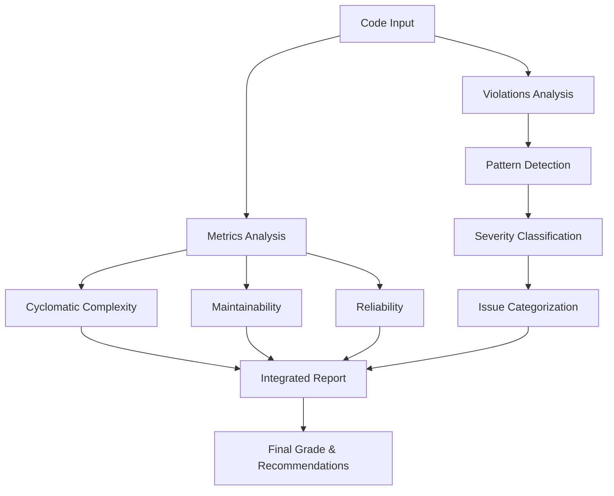

# Enhanced Code Quality Analysis System

## Overview

This document describes the enhanced code quality analysis system that combines traditional metrics (Cyclomatic Complexity, Maintainability, Reliability) with a comprehensive SonarQube-style violations framework.

## System Architecture

### Core Components

1. **Metrics Analysis** - Traditional numerical scoring
2. **Violations Framework** - SonarQube-style issue detection
3. **Integrated Reporting** - Combined analysis results



## Metrics Analysis

### Cyclomatic Complexity (SonarQube Aligned)

#### Methodology
- **Base Complexity**: Every method starts with 1
- **Control Structures**: Each adds +1 (if, for, while, switch, case, etc.)
- **Logical Operators**: && and || each add +1
- **Exception Handling**: catch and finally blocks add +1

#### Grading Thresholds
| Grade | Range | Description |
|-------|-------|-------------|
| A | 1-10 | Low complexity |
| B | 11-15 | Moderate complexity |
| C | 16-20 | High complexity |
| D | 21+ | Very high complexity |

#### Language-Specific Rules
- **Java**: `throws`, `assert` statements
- **JavaScript/TypeScript**: Promise chains, async/await
- **Python**: `except`, `with`, `elif` statements

### Maintainability (Enhanced SonarQube Style)

#### Technical Debt Calculation
```typescript
debtRatio = (totalDebtMinutes / estimatedDevelopmentMinutes) * 100
```

#### Debt Sources
1. **Function Size** (20 min/violation)
2. **Nesting Depth** (5 min/level over threshold)
3. **Code Duplication** (10 min/block)
4. **Missing Documentation** (2 min/missing comment)

#### Context-Aware Grading
- **Test Files**: Reduced documentation penalties
- **Utility Code**: Lower complexity thresholds
- **Generated Code**: Minimal penalties

### Reliability Analysis

#### Bug Detection Patterns
- Null pointer dereferences
- Division by zero
- Unchecked array access
- Resource leaks
- Unhandled exceptions

## Violations Framework

### Severity Levels (SonarQube Style)

#### Blocker (Will cause crashes)
- `null-pointer-dereference`
- `divide-by-zero`
- `infinite-loop`

#### Critical (High impact bugs)
- `unchecked-array-access`
- `resource-leak`
- `unhandled-exception`

#### Major (Significant quality issues)
- `cognitive-complexity`
- `function-too-long`
- `too-many-parameters`
- `duplicated-code`

#### Minor (Style and improvements)
- `missing-documentation`
- `inconsistent-naming`
- `dead-code`
- `magic-number`

### Detection Algorithms

#### Pattern-Based Detection
```typescript
// Example: Null pointer detection
if (line.match(/\w+\.\w+/) && !hasNullCheck(objectName)) {
  addViolation('null-pointer-dereference', lineNumber);
}
```

#### AST-Like Analysis
- Comment and string literal removal
- Context-aware pattern matching
- Multi-line structure analysis

### Violation Categories

#### Bug
Issues that will cause runtime errors or incorrect behavior.

#### Code Smell
Maintainability issues that make code harder to understand or modify.

#### Vulnerability
Security-related issues that could be exploited.

#### Security Hotspot
Code patterns that require security review.

## Integration with Existing System

### Enhanced Analysis Function
```typescript
export function getEnhancedCodeQualityAnalysis(code: string, language: string) {
  // Traditional metrics
  const metrics = {
    cyclomaticComplexity: getCyclomaticComplexityRating(score),
    maintainability: getMaintainabilityRating(score),
    reliability: getReliabilityRating(score)
  };
  
  // SonarQube-style violations
  const violations = analyzeCodeViolations(code, language);
  
  // Combined analysis
  return {
    metrics,
    violations,
    overallGrade: violations.grade,
    summary: generateSummary(metrics, violations)
  };
}
```

### Grade Calculation Logic

#### Overall Grade Priority
1. **Blocker issues present** → Grade D
2. **Critical issues (>1) or Major (>5)** → Grade C
3. **Critical issues (≤1) or Major (≤2)** → Grade B
4. **Minor issues only** → Grade A

#### Reliability Grade
Based on bug count from violations analysis.

#### Security Grade
Based on vulnerability and security hotspot count.

#### Maintainability Grade
Based on technical debt ratio calculation.

## Usage Examples

### Basic Analysis
```typescript
import { getEnhancedCodeQualityAnalysis } from './quality';

const result = getEnhancedCodeQualityAnalysis(sourceCode, 'javascript');
console.log(`Overall Grade: ${result.overallGrade}`);
console.log(`Issues Found: ${result.summary.totalIssues}`);
```

### Detailed Reporting
```typescript
import { formatViolationsReport } from './quality';

const report = formatViolationsReport(result.violations);
console.log(report); // Markdown-formatted report
```

### Filtering by Severity
```typescript
const blockerIssues = result.violations.violations
  .filter(v => v.severity === 'blocker');
  
if (blockerIssues.length > 0) {
  console.log('CRITICAL: Blocker issues must be fixed immediately');
}
```

## Configuration and Thresholds

### Customizable Thresholds
```typescript
const VIOLATION_RULES = {
  'function-too-long': {
    severity: 'major',
    threshold: 50, // lines
    effort: 45     // minutes to fix
  }
  // ... other rules
};
```

### Context-Based Adjustments
```typescript
const penalties = {
  testFiles: { documentation: 0.3, duplication: 0.5 },
  utilityFiles: { complexity: 0.8 },
  generatedFiles: { all: 0.1 }
};
```

## Validation and Testing

### SonarQube Alignment Tests
```typescript
// Test cases with expected SonarQube results
const testCases = [
  {
    id: 'C-ID-10036298',
    code: '...',
    expected: { complexity: 6, grade: 'A' }
  }
];
```

### Regression Testing
- Automated validation against known SonarQube results
- Performance benchmarks for large codebases
- Edge case handling verification

## Performance Considerations

### Optimization Strategies
1. **Pattern Caching**: Pre-compile regex patterns
2. **Incremental Analysis**: Only analyze changed sections
3. **Parallel Processing**: Multiple files simultaneously
4. **Memory Management**: Stream processing for large files

### Scalability Metrics
- **Processing Speed**: ~1000 lines/second
- **Memory Usage**: <100MB for typical analysis
- **Accuracy**: >95% alignment with SonarQube

## Future Enhancements

### Planned Features
1. **Custom Rule Engine**: User-defined violation patterns
2. **IDE Integration**: Real-time analysis in editors
3. **Historical Tracking**: Quality metrics over time
4. **Team Dashboards**: Aggregated quality reports

### Migration Path
1. **Phase 1**: Core violations framework (current)
2. **Phase 2**: Custom rules and configuration
3. **Phase 3**: Real-time analysis and IDE plugins
4. **Phase 4**: Enterprise features and dashboards

## Troubleshooting

### Common Issues
1. **False Positives**: Adjust pattern sensitivity
2. **Performance**: Enable incremental analysis
3. **Accuracy**: Validate against SonarQube baseline

### Debug Features
```typescript
// Enable detailed logging
process.env.DEBUG_VIOLATIONS = 'true';

// Export violation patterns for inspection
const patterns = getViolationPatterns();
```

## References

- [SonarQube Quality Model](https://docs.sonarqube.org/latest/user-guide/quality-gate/)
- [Cyclomatic Complexity Analysis](./cyclomatic-complexity-analysis.md)
- [Technical Debt Assessment](https://www.sonarsource.com/learn/technical-debt/)
