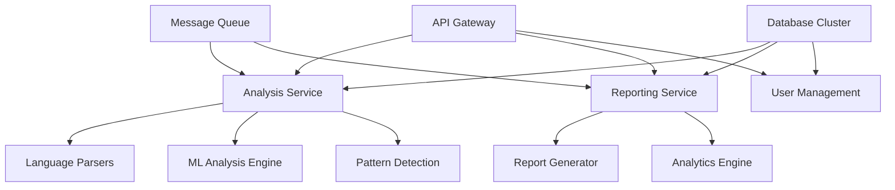

# Future Considerations & Roadmap

## Overview

This document outlines the strategic vision, planned enhancements, and long-term roadmap for the Code Alchemist AI Forge. It covers technology evolution, feature expansions, and architectural improvements planned for the next 2-3 years.

## Strategic Vision

### Mission Statement
To become the leading AI-powered code quality analysis platform that provides accurate, actionable, and educational insights for developers at all skill levels, while maintaining strict alignment with industry standards.

### Core Objectives
1. **Accuracy Enhancement**: Achieve >95% correlation with industry-standard tools
2. **Scope Expansion**: Evolve from single-file to full project analysis
3. **Intelligence Integration**: Incorporate AI/ML for advanced pattern recognition
4. **Ecosystem Integration**: Seamless integration with development workflows
5. **Educational Impact**: Become the go-to learning platform for code quality

## Technology Roadmap

### Phase 1: Foundation Enhancement (Q1-Q2 2025)

#### 1.1 Performance Optimization
**Objective**: Achieve sub-second analysis for files up to 10,000 LOC

**Technical Improvements**:
- **WebAssembly Integration**: Migrate compute-intensive analysis to WASM
- **Streaming Analysis**: Implement progressive analysis for large files
- **Memory Optimization**: Reduce memory footprint by 60%
- **Caching Layer**: Implement intelligent result caching

```typescript
// Future WebAssembly integration
interface WasmAnalysisEngine {
  analyzeComplexity(code: Uint8Array, language: string): Promise<ComplexityResult>;
  detectPatterns(code: Uint8Array, patterns: PatternSet): Promise<PatternMatches>;
  calculateMetrics(code: Uint8Array): Promise<CodeMetrics>;
}
```

#### 1.2 Enhanced Language Support
**Objective**: Achieve full support for top 10 programming languages

**Language Priorities**:
1. **C# Complete Support**: Full .NET ecosystem analysis
2. **Go Enhanced Parser**: Advanced concurrency pattern detection
3. **Rust Advanced Analysis**: Ownership and borrowing pattern recognition
4. **Kotlin Support**: Android development optimization
5. **Swift Analysis**: iOS development patterns

**Language-Specific Features**:
```rust
// Rust-specific analysis patterns
fn analyze_ownership_patterns(code: &str) -> OwnershipAnalysis {
    // Detect potential ownership violations
    // Analyze borrowing complexity
    // Memory safety pattern validation
}
```

#### 1.3 AST-Based Analysis Migration
**Objective**: Replace regex-based pattern matching with proper AST parsing

**Benefits**:
- **Accuracy Improvement**: Eliminate false positives from string matching
- **Context Awareness**: Understand code structure and semantics
- **Extensibility**: Easy addition of new analysis rules
- **Performance**: More efficient analysis algorithms

```typescript
// Future AST-based analysis
interface ASTAnalyzer {
  parseToAST(code: string, language: string): AbstractSyntaxTree;
  analyzeSemantics(ast: AbstractSyntaxTree): SemanticAnalysis;
  detectPatterns(ast: AbstractSyntaxTree, rules: AnalysisRule[]): PatternMatch[];
}
```

### Phase 2: Intelligence & Integration (Q3-Q4 2025)

#### 2.1 AI-Powered Analysis Engine
**Objective**: Incorporate machine learning for advanced code quality insights

**ML Capabilities**:
- **Pattern Learning**: Train models on high-quality codebases
- **Contextual Analysis**: Understand business logic patterns
- **Predictive Metrics**: Forecast maintenance complexity
- **Adaptive Thresholds**: Adjust standards based on project context

```python
# AI model training pipeline
class CodeQualityAI:
    def train_on_codebase(self, codebase: Codebase, quality_metrics: QualityMetrics):
        """Train on expert-validated code quality assessments"""
        pass
    
    def predict_quality_issues(self, code: str) -> List[PredictedIssue]:
        """Predict potential quality issues using trained models"""
        pass
    
    def suggest_improvements(self, code: str) -> List[Improvement]:
        """Generate contextual improvement suggestions"""
        pass
```

#### 2.2 Multi-File Project Analysis
**Objective**: Extend analysis to entire projects and codebases

**Project-Level Features**:
- **Dependency Analysis**: Cross-file dependency tracking
- **Architectural Assessment**: System-level design quality
- **Code Duplication**: Cross-file duplication detection
- **API Consistency**: Interface design pattern analysis

```typescript
// Future project analysis interface
interface ProjectAnalyzer {
  analyzeProject(projectRoot: string): Promise<ProjectAnalysis>;
  buildDependencyGraph(files: FileSet): DependencyGraph;
  detectArchitecturalIssues(graph: DependencyGraph): ArchitecturalIssue[];
  assessModularity(structure: ProjectStructure): ModularityScore;
}
```

#### 2.3 Real-Time Analysis Engine
**Objective**: Provide live analysis during code development

**Real-Time Features**:
- **Incremental Analysis**: Update analysis as code changes
- **Live Feedback**: Immediate quality metrics in editor
- **Smart Suggestions**: Context-aware improvement recommendations
- **Quality Trends**: Track quality changes over time

```typescript
// Real-time analysis interface
interface RealTimeAnalyzer {
  startSession(initialCode: string): AnalysisSession;
  updateCode(session: AnalysisSession, changes: CodeChange[]): void;
  getInstantFeedback(session: AnalysisSession): LiveFeedback;
  trackQualityTrend(session: AnalysisSession): QualityTrend;
}
```

### Phase 3: Advanced Features & Scale (2026)

#### 3.1 Team Collaboration Platform
**Objective**: Enable team-wide code quality management

**Collaboration Features**:
- **Team Dashboards**: Aggregate quality metrics across team
- **Quality Gates**: Automated quality checkpoints
- **Peer Review Integration**: Quality-aware code review
- **Knowledge Sharing**: Best practice recommendations

```typescript
// Team collaboration interfaces
interface TeamQualityDashboard {
  getTeamMetrics(teamId: string): TeamQualityMetrics;
  setQualityGates(rules: QualityGateRule[]): void;
  trackTeamProgress(timeframe: TimeRange): QualityProgress;
  generateTeamReport(period: ReportPeriod): TeamQualityReport;
}
```

#### 3.2 Enterprise Integration Suite
**Objective**: Seamless integration with enterprise development workflows

**Integration Capabilities**:
- **CI/CD Pipeline Integration**: Automated quality gates
- **Issue Tracker Sync**: Quality issue tracking
- **Metrics Aggregation**: Enterprise-wide quality monitoring
- **Compliance Reporting**: Regulatory compliance support

```yaml
# CI/CD Pipeline Integration Example
quality_gate:
  stage: quality_check
  script:
    - code-alchemist analyze --project . --format junit
    - code-alchemist gate --min-grade B --fail-on-blocker
  artifacts:
    reports:
      junit: quality-report.xml
```

#### 3.3 Advanced Analytics Platform
**Objective**: Provide deep insights into code quality trends and patterns

**Analytics Features**:
- **Quality Forecasting**: Predict future maintenance needs
- **Technical Debt Economics**: Cost-benefit analysis of improvements
- **Developer Productivity**: Quality impact on development velocity
- **Risk Assessment**: Identify high-risk code areas

## Feature Enhancement Roadmap

### Code Analysis Enhancements

#### Advanced Pattern Recognition
```typescript
// Future pattern recognition capabilities
interface AdvancedPatternDetector {
  detectDesignPatterns(code: string): DesignPatternUsage[];
  identifyAntiPatterns(code: string): AntiPattern[];
  assessArchitecturalCompliance(codebase: Codebase): ComplianceReport;
  validateBestPractices(code: string, standards: CodingStandards): ValidationResult;
}
```

#### Semantic Code Understanding
```typescript
// Semantic analysis capabilities
interface SemanticAnalyzer {
  understandBusinessLogic(code: string): BusinessLogicMap;
  assessDataFlow(functions: Function[]): DataFlowAnalysis;
  validateErrorHandling(code: string): ErrorHandlingAssessment;
  analyzePerformancePatterns(code: string): PerformanceAnalysis;
}
```

### User Experience Enhancements

#### Intelligent Suggestions Engine
```typescript
// AI-powered improvement suggestions
interface SuggestionEngine {
  generateImprovements(code: string, context: CodeContext): Improvement[];
  rankSuggestionsByImpact(suggestions: Improvement[]): RankedSuggestion[];
  provideEducationalContent(issue: QualityIssue): EducationalContent;
  customizeForDeveloper(suggestions: Improvement[], developer: DeveloperProfile): PersonalizedSuggestion[];
}
```

#### Interactive Learning Platform
- **Guided Tutorials**: Interactive code quality learning
- **Challenge Modes**: Gamified quality improvement exercises
- **Skill Assessments**: Developer skill evaluation and growth tracking
- **Best Practice Library**: Curated examples of high-quality code

### Integration Ecosystem

#### IDE Plugin Suite
```typescript
// VSCode extension interface
interface CodeAlchemistVSCode {
  provideRealTimeFeedback(document: TextDocument): QualityMetrics;
  showInlineWarnings(issues: QualityIssue[]): void;
  integrateWithGitWorkflow(changes: GitChange[]): QualityImpact;
  suggestRefactorings(selection: Range): RefactoringOption[];
}
```

#### API Platform
```typescript
// Public API for third-party integrations
interface CodeAlchemistAPI {
  analyzeCode(request: AnalysisRequest): Promise<AnalysisResponse>;
  createProject(config: ProjectConfig): Promise<Project>;
  getQualityTrends(projectId: string, period: TimePeriod): Promise<QualityTrend>;
  setQualityGates(projectId: string, gates: QualityGate[]): Promise<void>;
}
```

## Technical Architecture Evolution

### Microservices Architecture Migration


### Cloud-Native Infrastructure
- **Containerization**: Docker-based deployment
- **Orchestration**: Kubernetes for scaling
- **Serverless Functions**: Event-driven analysis triggers
- **Edge Computing**: Distributed analysis for performance

### Data Architecture Evolution
```typescript
// Future data layer architecture
interface DataLayer {
  codeRepository: CodeRepositoryService;
  analyticsDatastore: AnalyticsDatabase;
  mlModelRegistry: ModelRegistry;
  cacheLayer: DistributedCache;
  eventStream: EventStreamingPlatform;
}
```

## Research & Innovation Areas

### Academic Partnerships
- **Code Quality Research**: Collaborate with universities on quality metrics
- **ML Model Development**: Research advanced code analysis algorithms
- **Developer Productivity**: Study impact of quality tools on productivity
- **Educational Effectiveness**: Research optimal learning approaches

### Emerging Technologies
- **Quantum Computing**: Explore quantum algorithms for complex analysis
- **Blockchain**: Code quality verification and immutable quality records
- **AR/VR**: Immersive code quality visualization
- **Edge AI**: Local, privacy-preserving code analysis

### Innovation Labs
```typescript
// Experimental features in development
interface InnovationLab {
  experimentalFeatures: {
    quantumAnalysis: QuantumCodeAnalyzer;
    naturalLanguageQuery: NLQueryEngine;
    visualCodeQuality: VRVisualization;
    blockchainVerification: QualityBlockchain;
  };
}
```

## Market Expansion Strategy

### Target Market Evolution

#### Phase 1: Individual Developers & Students
- **Current Focus**: Personal learning and improvement
- **Tools**: Web-based analysis, educational content
- **Metrics**: User engagement, learning outcomes

#### Phase 2: Small Teams & Startups
- **Features**: Team collaboration, basic project analysis
- **Tools**: Team dashboards, simple integrations
- **Metrics**: Team adoption, quality improvement

#### Phase 3: Enterprise Organizations
- **Features**: Full project analysis, compliance reporting
- **Tools**: Enterprise integrations, custom rules
- **Metrics**: Enterprise adoption, ROI measurement

### Competitive Positioning
```typescript
// Competitive advantage matrix
interface CompetitivePosition {
  accuracyLeadership: SonarQubeAlignmentStrategy;
  educationalFocus: DeveloperLearningPlatform;
  aiIntegration: MLPoweredAnalysis;
  costEffectiveness: FreemiumModel;
  easeOfUse: IntuitiveDeveloperExperience;
}
```

## Risk Assessment & Mitigation

### Technical Risks
1. **Scalability Challenges**: Mitigation through cloud-native architecture
2. **AI Model Accuracy**: Continuous training and validation
3. **Performance Degradation**: Advanced optimization and caching
4. **Security Concerns**: Zero-trust security architecture

### Market Risks
1. **Competition from Established Players**: Differentiation through AI and education
2. **Technology Obsolescence**: Continuous innovation and adaptation
3. **User Adoption Challenges**: Focus on developer experience
4. **Economic Downturn Impact**: Freemium model for resilience

### Mitigation Strategies
```typescript
// Risk mitigation framework
interface RiskMitigation {
  technicalRisks: {
    continuousMonitoring: PerformanceMonitoring;
    automaticScaling: ScalingStrategy;
    fallbackSystems: FallbackMechanism;
  };
  
  marketRisks: {
    competitiveIntelligence: MarketAnalysis;
    customerRetention: UserEngagementStrategy;
    diversification: MultiMarketApproach;
  };
}
```

## Success Metrics & KPIs

### Technical Metrics
- **Analysis Accuracy**: >95% correlation with industry standards
- **Performance**: <1s analysis time for 10K LOC files
- **Availability**: 99.9% uptime for analysis services
- **Scalability**: Support for 100K+ concurrent analyses

### User Metrics
- **Adoption Rate**: 50% month-over-month growth
- **User Engagement**: 70% weekly active users
- **Educational Impact**: Measurable skill improvement
- **Customer Satisfaction**: >4.5/5 user rating

### Business Metrics
- **Revenue Growth**: 100% year-over-year growth
- **Market Share**: 15% of code analysis tool market
- **Enterprise Adoption**: 1000+ enterprise customers
- **Global Reach**: Availability in 20+ languages

## Investment & Resources

### Technology Investment
- **R&D Budget**: 40% of revenue invested in innovation
- **Infrastructure**: Cloud-native, globally distributed
- **AI/ML Capabilities**: Dedicated ML engineering team
- **Security**: Enterprise-grade security implementation

### Human Resources
- **Engineering Team**: 60% of workforce
- **Research Team**: 15% focused on innovation
- **Customer Success**: 15% for user support and growth
- **Business Development**: 10% for partnerships and sales

### Partnership Strategy
- **Technology Partners**: Cloud providers, AI platforms
- **Academic Partners**: Universities for research collaboration
- **Industry Partners**: Development tool vendors
- **Integration Partners**: CI/CD and DevOps tool providers

## Conclusion

The future of Code Alchemist AI Forge lies in becoming an intelligent, comprehensive, and indispensable tool for developers and teams worldwide. By focusing on accuracy, education, and seamless integration, we aim to fundamentally improve how developers understand and improve code quality.

Our roadmap balances ambitious technical goals with practical business considerations, ensuring sustainable growth while maintaining our commitment to developer education and code quality excellence.

---

**Last Updated**: 2025-06-09  
**Version**: 2.0.0 (Strategic Roadmap)
