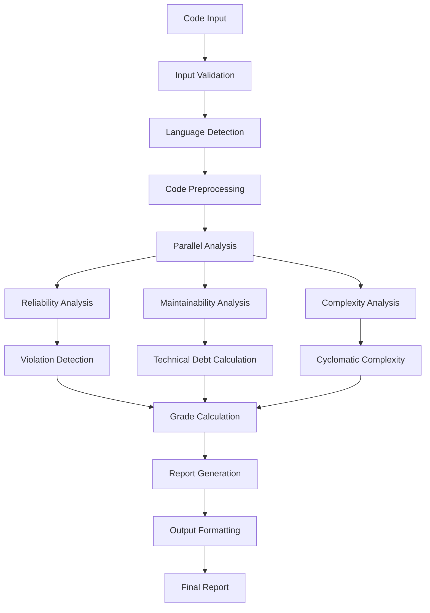
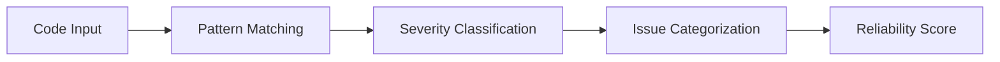
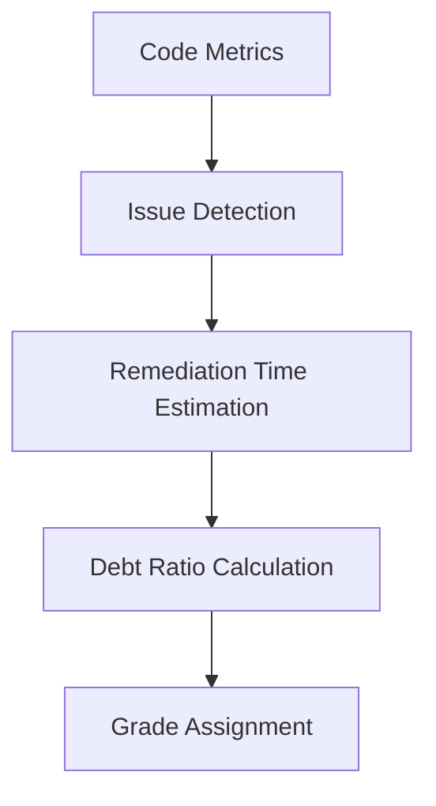

# Process Flow Documentation

## Overview

This document outlines the complete process flow of the Code Alchemist AI Forge, from code input to final analysis report generation. The system follows a structured pipeline approach with parallel processing capabilities for optimal performance.

## High-Level Process Flow



## Detailed Process Stages

### Stage 1: Input Processing

#### 1.1 Code Ingestion
```typescript
interface CodeInput {
  source: string;           // Raw source code
  language?: string;        // Optional language hint
  context?: string;         // File path or context
  options?: AnalysisOptions; // Configuration options
}
```

**Process Steps:**
1. Accept source code through web interface
2. Validate input length and format
3. Sanitize input for security
4. Store in temporary processing buffer

#### 1.2 Input Validation
```typescript
function validateInput(input: CodeInput): ValidationResult {
  // Check for empty or invalid input
  if (!input.source || input.source.trim().length === 0) {
    return { valid: false, error: 'Empty code input' };
  }
  
  // Check size limits
  if (input.source.length > MAX_CODE_LENGTH) {
    return { valid: false, error: 'Code too long' };
  }
  
  // Basic syntax validation
  if (containsSuspiciousPatterns(input.source)) {
    return { valid: false, error: 'Potentially malicious code' };
  }
  
  return { valid: true };
}
```

#### 1.3 Language Detection
```typescript
function detectLanguage(code: string, hint?: string): ProgrammingLanguage {
  // Use hint if provided and valid
  if (hint && supportedLanguages.includes(hint)) {
    return getLanguageConfig(hint);
  }
  
  // Pattern-based detection
  const patterns = {
    javascript: [/function\s+\w+/, /const\s+\w+\s*=/, /=>\s*{/],
    python: [/def\s+\w+/, /import\s+\w+/, /if\s+__name__/],
    java: [/public\s+class/, /public\s+static\s+void/, /import\s+java/],
    cpp: [/#include\s*</, /using\s+namespace/, /int\s+main/]
  };
  
  return detectByPatterns(code, patterns) || getDefaultLanguage();
}
```

### Stage 2: Code Preprocessing

#### 2.1 Lexical Analysis
```typescript
interface LexicalData {
  lines: string[];           // Individual code lines
  tokens: Token[];          // Parsed tokens
  comments: Comment[];      // Comment blocks
  functions: Function[];    // Function definitions
  classes: Class[];         // Class definitions
}
```

**Processing Steps:**
1. **Line Splitting**: Break code into individual lines
2. **Comment Extraction**: Identify and extract comments
3. **String Literal Removal**: Remove string content to avoid false positives
4. **Token Parsing**: Break code into meaningful tokens
5. **Structure Detection**: Identify functions, classes, and blocks

#### 2.2 Syntax Tree Construction
```typescript
function buildSyntaxTree(code: string, language: string): SyntaxTree {
  const lexer = new LanguageLexer(language);
  const tokens = lexer.tokenize(code);
  
  const parser = new LanguageParser(language);
  return parser.parse(tokens);
}
```

### Stage 3: Parallel Analysis Pipeline

#### 3.1 Analysis Coordination
```typescript
async function performParallelAnalysis(
  preprocessedCode: PreprocessedCode
): Promise<AnalysisResults> {
  
  const [
    reliabilityResult,
    maintainabilityResult,
    complexityResult
  ] = await Promise.all([
    analyzeReliability(preprocessedCode),
    analyzeMaintainability(preprocessedCode),
    analyzeComplexity(preprocessedCode)
  ]);
  
  return {
    reliability: reliabilityResult,
    maintainability: maintainabilityResult,
    complexity: complexityResult
  };
}
```

### Stage 4: Reliability Analysis

#### 4.1 Pattern Detection Pipeline


#### 4.2 Critical Pattern Detection
```typescript
function detectCriticalPatterns(code: string): CriticalIssue[] {
  const patterns = {
    blocker: [
      /\bnull\s*\.\s*\w+/g,           // Null pointer dereference
      /\/\s*0(?!\.\d)/g,              // Division by zero
      /\[\s*\w+\s*\].*(?!.*length)/g  // Unchecked array access
    ],
    critical: [
      /try\s*{[^}]*}\s*catch\s*\([^)]*\)\s*{[\s]*}/g, // Empty catch
      /while\s*\(\s*true\s*\)(?![^{]*break)/g,        // Infinite loop
      /System\.exit\s*\(/g                             // System exit calls
    ]
  };
  
  return detectPatterns(code, patterns);
}
```

#### 4.3 SonarQube Violation Framework
```typescript
function analyzeViolations(code: string, language: string): ViolationResult {
  const violationDetector = new ViolationDetector(language);
  
  const violations = violationDetector.detect(code);
  const summary = categorizeViolations(violations);
  const grade = calculateViolationGrade(summary);
  
  return {
    violations,
    summary,
    grade,
    recommendations: generateRecommendations(violations)
  };
}
```

### Stage 5: Maintainability Analysis

#### 5.1 Technical Debt Calculation


#### 5.2 Code Smell Detection
```typescript
function detectCodeSmells(code: string, language: string): CodeSmell[] {
  const detector = new TechnicalDebtCalculator(code, language);
  
  return [
    ...detector.detectLargeFunctions(),
    ...detector.detectDeepNesting(),
    ...detector.detectCodeDuplication(),
    ...detector.detectPoorNaming(),
    ...detector.detectMissingDocumentation(),
    ...detector.detectUnusedCode(),
    ...detector.detectMagicNumbers()
  ];
}
```

#### 5.3 Language-Specific Analysis
```typescript
function performLanguageSpecificAnalysis(
  code: string, 
  language: string
): LanguageAnalysisResult {
  
  switch (language.toLowerCase()) {
    case 'cpp':
      return new CppParser(code).analyze();
    case 'java':
      return new JavaAnalyzer(code).analyze();
    case 'python':
      return new PythonAnalyzer(code).analyze();
    default:
      return new GenericAnalyzer(code).analyze();
  }
}
```

### Stage 6: Complexity Analysis

#### 6.1 Cyclomatic Complexity Calculation
```typescript
function calculateCyclomaticComplexity(
  code: string, 
  language: string
): ComplexityResult {
  
  let complexity = 1; // Base complexity
  
  // Language-specific patterns
  const patterns = getLanguagePatterns(language);
  
  // Count decision points
  for (const pattern of patterns.decisionPoints) {
    const matches = code.match(pattern) || [];
    complexity += matches.length;
  }
  
  // Apply nesting multiplier for deep nesting
  const nestingDepth = calculateNestingDepth(code);
  if (nestingDepth > 5) {
    complexity *= 1.1; // SonarQube-style adjustment
  }
  
  return {
    score: complexity,
    grade: getComplexityGrade(complexity),
    breakdown: getComplexityBreakdown(code, patterns)
  };
}
```

#### 6.2 Cognitive Complexity Assessment
```typescript
function calculateCognitiveComplexity(code: string): CognitiveResult {
  let cognitiveScore = 0;
  
  // Nested structures increase cognitive load
  const nestingWeights = { 1: 1, 2: 2, 3: 3, 4: 5 };
  
  // Control flow structures
  cognitiveScore += countControlStructures(code) * getCurrentNestingWeight();
  
  return {
    score: cognitiveScore,
    recommendations: generateCognitiveRecommendations(cognitiveScore)
  };
}
```

### Stage 7: Grade Calculation & Integration

#### 7.1 Multi-Dimensional Scoring
```typescript
function calculateFinalGrade(
  reliability: ReliabilityResult,
  maintainability: MaintainabilityResult,
  complexity: ComplexityResult
): FinalGrade {
  
  // Violation precedence (SonarQube style)
  if (reliability.violations.blocker > 0) return 'D';
  if (reliability.violations.critical > 1) return 'C';
  
  // Weight-based calculation
  const weights = {
    reliability: 0.4,
    maintainability: 0.35,
    complexity: 0.25
  };
  
  const weightedScore = 
    gradeToScore(reliability.grade) * weights.reliability +
    gradeToScore(maintainability.grade) * weights.maintainability +
    gradeToScore(complexity.grade) * weights.complexity;
  
  return scoreToGrade(weightedScore);
}
```

#### 7.2 Context Adjustments
```typescript
function applyContextAdjustments(
  grade: Grade, 
  context: AnalysisContext
): AdjustedGrade {
  
  let adjustment = 0;
  
  // File type adjustments
  if (context.isTestFile) {
    adjustment += 0.1; // Relaxed requirements for tests
  }
  
  if (context.isUtilityCode) {
    adjustment += 0.05; // Slight relaxation for utilities
  }
  
  // Project size adjustments
  if (context.projectSize < 1000) {
    adjustment += 0.05; // Relaxed for small projects
  }
  
  return applyAdjustment(grade, adjustment);
}
```

### Stage 8: Report Generation

#### 8.1 Report Structure Assembly
```typescript
interface AnalysisReport {
  summary: ReportSummary;
  metrics: {
    reliability: ReliabilityReport;
    maintainability: MaintainabilityReport;
    complexity: ComplexityReport;
  };
  violations: ViolationReport;
  recommendations: Recommendation[];
  metadata: ReportMetadata;
}
```

#### 8.2 Detailed Breakdown Generation
```typescript
function generateDetailedReport(results: AnalysisResults): DetailedReport {
  return {
    executiveSummary: generateExecutiveSummary(results),
    metricsBreakdown: generateMetricsBreakdown(results),
    issueDetails: generateIssueDetails(results.violations),
    improvementPlan: generateImprovementPlan(results),
    technicalDebtAnalysis: generateDebtAnalysis(results.maintainability),
    complexityHotspots: identifyComplexityHotspots(results.complexity)
  };
}
```

### Stage 9: Output Formatting

#### 9.1 Multiple Format Support
```typescript
function formatOutput(
  report: AnalysisReport, 
  format: OutputFormat
): FormattedOutput {
  
  switch (format) {
    case 'markdown':
      return new MarkdownFormatter().format(report);
    case 'json':
      return new JsonFormatter().format(report);
    case 'html':
      return new HtmlFormatter().format(report);
    case 'pdf':
      return new PdfFormatter().format(report);
    default:
      return new DefaultFormatter().format(report);
  }
}
```

#### 9.2 Interactive Elements
```typescript
function addInteractiveElements(report: FormattedReport): InteractiveReport {
  return {
    ...report,
    expandableViolations: createExpandableViolations(report.violations),
    interactiveMetrics: createInteractiveCharts(report.metrics),
    actionableRecommendations: createActionableItems(report.recommendations)
  };
}
```

## Error Handling & Recovery

### Error Classification
```typescript
enum ProcessingError {
  INPUT_VALIDATION_FAILED,
  LANGUAGE_DETECTION_FAILED,
  PARSING_ERROR,
  ANALYSIS_TIMEOUT,
  MEMORY_LIMIT_EXCEEDED,
  UNKNOWN_ERROR
}
```

### Recovery Strategies
1. **Graceful Degradation**: Provide partial results when possible
2. **Fallback Analysis**: Use generic analysis when language-specific fails
3. **Error Reporting**: Detailed error information for debugging
4. **Retry Logic**: Automatic retry for transient failures

## Performance Optimization

### Caching Strategy
```typescript
interface CacheKey {
  codeHash: string;
  language: string;
  analysisVersion: string;
}

function getCachedResult(key: CacheKey): AnalysisResult | null {
  return analysisCache.get(generateCacheKey(key));
}
```

### Streaming Analysis
```typescript
function* analyzeCodeStream(code: string): Generator<PartialResult> {
  yield* analyzeReliabilityStream(code);
  yield* analyzeMaintainabilityStream(code);
  yield* analyzeComplexityStream(code);
}
```

## Quality Assurance

### Validation Pipeline
1. **Unit Tests**: Individual component testing
2. **Integration Tests**: End-to-end workflow validation
3. **Regression Tests**: SonarQube alignment verification
4. **Performance Tests**: Throughput and latency benchmarks

### Monitoring & Metrics
- Analysis processing time
- Memory usage patterns
- Error rates by stage
- Grade distribution analysis
- User feedback correlation

---

**Last Updated**: 2025-06-09  
**Version**: 2.0.0 (Enhanced Pipeline)
