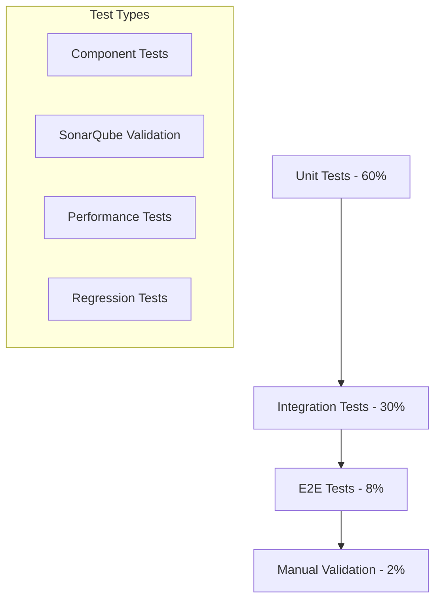

# Testing Strategy Documentation

## Overview

The Code Alchemist AI Forge employs a comprehensive testing strategy to ensure accuracy, reliability, and consistency with industry standards (particularly SonarQube alignment). This document outlines our multi-layered testing approach, validation methodologies, and quality assurance processes.

## Testing Philosophy

### Core Principles
1. **SonarQube Alignment**: Maintain >90% correlation with SonarQube results
2. **Deterministic Results**: Same code should always produce same analysis
3. **Language Consistency**: Ensure consistent behavior across supported languages
4. **Performance Reliability**: Maintain consistent response times
5. **Regression Prevention**: Prevent quality degradation with updates

### Quality Metrics
- **Accuracy Target**: 90%+ correlation with expert manual reviews
- **Performance Target**: <2s analysis time for files <5000 LOC
- **Reliability Target**: 99.9% successful analysis completion
- **Consistency Target**: 100% reproducible results

## Test Architecture

### Testing Pyramid



### Test Categories

#### 1. Unit Tests (60% of test effort)
- Individual function testing
- Component isolation testing
- Edge case validation
- Error handling verification

#### 2. Integration Tests (30% of test effort)
- Module interaction testing
- Pipeline flow validation
- API contract testing
- Cross-language consistency

#### 3. End-to-End Tests (8% of test effort)
- Complete workflow testing
- Real-world scenario validation
- User journey testing
- Performance benchmarking

#### 4. Manual Validation (2% of test effort)
- Expert review correlation
- Industry standard alignment
- Complex scenario validation
- User acceptance testing

## Unit Testing Strategy

### Core Module Tests

#### Reliability Rating Tests
```typescript
describe('ReliabilityRating', () => {
  describe('SonarQube Alignment', () => {
    test('should match SonarQube grades for known test cases', () => {
      const testCases = [
        {
          issues: [{ severity: 'blocker', type: 'null-pointer' }],
          expectedGrade: 'D'
        },
        {
          issues: [{ severity: 'critical', type: 'resource-leak' }],
          expectedGrade: 'C'
        },
        {
          issues: [{ severity: 'major', type: 'logic-error' }],
          expectedGrade: 'B'
        }
      ];
      
      testCases.forEach(({ issues, expectedGrade }) => {
        const result = getReliabilityRating(0, issues);
        expect(result.score).toBe(expectedGrade);
      });
    });
  });
  
  describe('Edge Cases', () => {
    test('should handle empty issues array', () => {
      const result = getReliabilityRating(95, []);
      expect(result.score).toBe('A');
    });
    
    test('should handle undefined issues', () => {
      const result = getReliabilityRating(85);
      expect(result.score).toBe('B');
    });
  });
});
```

#### Technical Debt Calculator Tests
```typescript
describe('TechnicalDebtCalculator', () => {
  describe('Function Size Analysis', () => {
    test('should detect oversized functions correctly', () => {
      const longFunction = 'function test() {\n' + '  // line\n'.repeat(60) + '}';
      const calculator = new TechnicalDebtCalculator(longFunction, 'javascript', 62);
      
      const result = calculator.calculateTechnicalDebt();
      const functionSizeIssues = result.issues.filter(i => i.category === 'functionSize');
      
      expect(functionSizeIssues.length).toBeGreaterThan(0);
      expect(functionSizeIssues[0].severity).toBe('major');
    });
  });
  
  describe('Code Duplication Detection', () => {
    test('should identify duplicated code blocks', () => {
      const duplicatedCode = `
        function processUserA() {
          const user = getUser();
          if (user.isValid()) {
            user.activate();
            user.sendNotification();
            return user.getData();
          }
        }
        
        function processUserB() {
          const user = getUser();
          if (user.isValid()) {
            user.activate();
            user.sendNotification();
            return user.getData();
          }
        }
      `;
      
      const calculator = new TechnicalDebtCalculator(duplicatedCode, 'javascript', 16);
      const result = calculator.calculateTechnicalDebt();
      
      const duplicationIssues = result.issues.filter(i => i.category === 'duplication');
      expect(duplicationIssues.length).toBeGreaterThan(0);
    });
  });
});
```

#### Cyclomatic Complexity Tests
```typescript
describe('CyclomaticComplexity', () => {
  describe('SonarQube Methodology', () => {
    test('should calculate complexity exactly like SonarQube', () => {
      const testCases = [
        {
          code: 'function simple() { return true; }',
          expected: 1,
          language: 'javascript'
        },
        {
          code: `
            function moderate(x) {
              if (x > 0) {
                for (let i = 0; i < x; i++) {
                  if (i % 2 === 0) {
                    return i;
                  }
                }
              }
              return -1;
            }
          `,
          expected: 4, // 1 + if + for + if
          language: 'javascript'
        }
      ];
      
      testCases.forEach(({ code, expected, language }) => {
        const complexity = calculateCyclomaticComplexity(code, language);
        expect(complexity).toBe(expected);
      });
    });
  });
  
  describe('Language-Specific Patterns', () => {
    test('should handle JavaScript async patterns', () => {
      const asyncCode = `
        async function fetchData() {
          try {
            const result = await fetch('/api/data')
              .then(response => response.json())
              .catch(error => handleError(error));
            return result;
          } catch (error) {
            throw new Error('Failed to fetch');
          }
        }
      `;
      
      const complexity = calculateCyclomaticComplexity(asyncCode, 'javascript');
      expect(complexity).toBe(4); // 1 + try + then + catch
    });
  });
});
```

### Language-Specific Tests

#### C++ Parser Tests
```typescript
describe('CppParser', () => {
  describe('Function Detection', () => {
    test('should parse standard C++ functions', () => {
      const cppCode = `
        int add(int a, int b) {
          return a + b;
        }
        
        class Calculator {
        public:
          virtual double divide(double a, double b) = 0;
          static int multiply(int a, int b);
        private:
          void helper();
        };
      `;
      
      const parser = new CppParser(cppCode);
      const result = parser.parse();
      
      expect(result.functions.length).toBe(4);
      expect(result.classes.length).toBe(1);
      expect(result.functions.find(f => f.name === 'divide')?.isVirtual).toBe(true);
    });
  });
  
  describe('Memory Management Analysis', () => {
    test('should detect potential memory issues', () => {
      const riskyCode = `
        class Resource {
        public:
          Resource() { data = new int[100]; }
          // Missing virtual destructor
          void process() { /* ... */ }
        private:
          int* data;
        };
      `;
      
      const parser = new CppParser(riskyCode);
      const result = parser.parse();
      
      // Should detect missing virtual destructor
      expect(result.classes[0].hasMissingVirtualDestructor).toBe(true);
    });
  });
});
```

## Integration Testing

### Pipeline Integration Tests
```typescript
describe('Analysis Pipeline Integration', () => {
  test('should process complete analysis workflow', async () => {
    const testCode = `
      function complexFunction(data) {
        if (!data) return null;
        
        const results = [];
        for (let i = 0; i < data.length; i++) {
          if (data[i].isValid) {
            try {
              const processed = processItem(data[i]);
              if (processed && processed.value > 0) {
                results.push(processed);
              } else {
                console.log('Invalid processed item');
              }
            } catch (error) {
              // Empty catch block - should be detected
            }
          }
        }
        return results;
      }
    `;
    
    const result = await analyzeCode(testCode, 'javascript');
    
    // Verify all analysis dimensions are present
    expect(result.reliability).toBeDefined();
    expect(result.maintainability).toBeDefined();
    expect(result.cyclomaticComplexity).toBeDefined();
    
    // Verify issue detection
    expect(result.reliability.issues.length).toBeGreaterThan(0);
    expect(result.reliability.issues.some(issue => 
      issue.includes('empty catch')
    )).toBe(true);
  });
});
```

### Cross-Language Consistency Tests
```typescript
describe('Cross-Language Consistency', () => {
  test('should produce consistent complexity scores across languages', () => {
    const logicPatterns = [
      {
        javascript: 'if (x > 0 && y < 10) { return true; }',
        java: 'if (x > 0 && y < 10) { return true; }',
        python: 'if x > 0 and y < 10:\n    return True',
        expectedComplexity: 2 // 1 + if + &&
      }
    ];
    
    logicPatterns.forEach(({ javascript, java, python, expectedComplexity }) => {
      const jsComplexity = calculateCyclomaticComplexity(javascript, 'javascript');
      const javaComplexity = calculateCyclomaticComplexity(java, 'java');
      const pythonComplexity = calculateCyclomaticComplexity(python, 'python');
      
      expect(jsComplexity).toBe(expectedComplexity);
      expect(javaComplexity).toBe(expectedComplexity);
      expect(pythonComplexity).toBe(expectedComplexity);
    });
  });
});
```

## SonarQube Validation Testing

### Validation Test Suite
```typescript
describe('SonarQube Alignment Validation', () => {
  const validationCases = [
    {
      id: 'JAVA-COMPLEX-001',
      language: 'java',
      code: readTestFile('java-complex-001.java'),
      sonarQubeResults: {
        complexity: 12,
        grade: 'B',
        technicalDebt: '45min',
        debtRatio: 7.2
      }
    },
    {
      id: 'JS-ASYNC-001',
      language: 'javascript',
      code: readTestFile('js-async-001.js'),
      sonarQubeResults: {
        complexity: 8,
        grade: 'A',
        technicalDebt: '20min',
        debtRatio: 3.1
      }
    }
  ];
  
  validationCases.forEach(({ id, language, code, sonarQubeResults }) => {
    test(`should match SonarQube results for ${id}`, () => {
      const analysis = getEnhancedCodeQualityAnalysis(code, language);
      
      // Complexity alignment (exact match required)
      expect(analysis.metrics.cyclomaticComplexity.score).toBe(sonarQubeResults.complexity);
      
      // Grade alignment (exact match required)
      expect(analysis.overallGrade).toBe(sonarQubeResults.grade);
      
      // Technical debt alignment (±10% tolerance)
      const debtVariance = Math.abs(
        analysis.summary.debtRatio - sonarQubeResults.debtRatio
      );
      expect(debtVariance).toBeLessThan(sonarQubeResults.debtRatio * 0.1);
    });
  });
});
```

### Validation Report Generation
```typescript
function generateValidationReport(): ValidationReport {
  const results = runValidationSuite();
  
  return {
    totalTests: results.length,
    passedTests: results.filter(r => r.passed).length,
    alignmentAccuracy: calculateAlignmentAccuracy(results),
    deviations: results.filter(r => !r.passed),
    recommendations: generateRecommendations(results)
  };
}
```

## Performance Testing

### Load Testing
```typescript
describe('Performance Testing', () => {
  test('should handle large codebases efficiently', async () => {
    const largeCodebase = generateLargeCodebase(5000); // 5000 lines
    
    const startTime = performance.now();
    const result = await analyzeCode(largeCodebase, 'javascript');
    const endTime = performance.now();
    
    const analysisTime = endTime - startTime;
    
    // Performance targets
    expect(analysisTime).toBeLessThan(5000); // < 5 seconds
    expect(result).toBeDefined();
    expect(result.overallGrade).toMatch(/[ABCD]/);
  });
  
  test('should maintain memory usage within limits', () => {
    const beforeMemory = process.memoryUsage().heapUsed;
    
    // Process multiple analyses
    for (let i = 0; i < 10; i++) {
      const code = generateTestCode(1000);
      analyzeCode(code, 'javascript');
    }
    
    // Force garbage collection
    if (global.gc) global.gc();
    
    const afterMemory = process.memoryUsage().heapUsed;
    const memoryIncrease = afterMemory - beforeMemory;
    
    // Memory should not increase significantly
    expect(memoryIncrease).toBeLessThan(50 * 1024 * 1024); // < 50MB
  });
});
```

### Benchmark Testing
```typescript
describe('Benchmark Testing', () => {
  const benchmarkSuite = [
    { name: 'Small File (100 LOC)', size: 100, targetTime: 100 },
    { name: 'Medium File (1000 LOC)', size: 1000, targetTime: 500 },
    { name: 'Large File (5000 LOC)', size: 5000, targetTime: 2000 }
  ];
  
  benchmarkSuite.forEach(({ name, size, targetTime }) => {
    test(`${name} analysis performance`, async () => {
      const code = generateTestCode(size);
      
      const times = [];
      for (let i = 0; i < 5; i++) {
        const start = performance.now();
        await analyzeCode(code, 'javascript');
        const end = performance.now();
        times.push(end - start);
      }
      
      const averageTime = times.reduce((a, b) => a + b) / times.length;
      expect(averageTime).toBeLessThan(targetTime);
    });
  });
});
```

## Regression Testing

### Automated Regression Suite
```typescript
describe('Regression Testing', () => {
  const regressionCases = loadRegressionTestCases();
  
  regressionCases.forEach(testCase => {
    test(`Regression: ${testCase.id}`, () => {
      const result = analyzeCode(testCase.code, testCase.language);
      
      // Verify results haven't changed
      expect(result.overallGrade).toBe(testCase.expectedGrade);
      expect(result.reliability.score).toBe(testCase.expectedReliability);
      expect(result.maintainability.score).toBe(testCase.expectedMaintainability);
      expect(result.cyclomaticComplexity.score).toBe(testCase.expectedComplexity);
    });
  });
});
```

### Baseline Management
```typescript
function updateRegressionBaseline() {
  const testCases = getStandardTestCases();
  const newBaseline = {};
  
  testCases.forEach(testCase => {
    const result = analyzeCode(testCase.code, testCase.language);
    newBaseline[testCase.id] = {
      overallGrade: result.overallGrade,
      reliability: result.reliability.score,
      maintainability: result.maintainability.score,
      complexity: result.cyclomaticComplexity.score,
      timestamp: new Date().toISOString()
    };
  });
  
  saveBaseline(newBaseline);
}
```

## Test Data Management

### Test Case Categories
1. **Synthetic Test Cases**: Generated code with known characteristics
2. **Real-World Examples**: Actual code from open-source projects
3. **Edge Cases**: Boundary conditions and error scenarios
4. **Language Variants**: Same logic in different programming languages

### Test Data Organization
```
tests/
├── unit/
│   ├── reliability/
│   ├── maintainability/
│   └── complexity/
├── integration/
│   ├── pipeline/
│   └── cross-language/
├── validation/
│   ├── sonarqube-alignment/
│   └── expert-correlation/
├── performance/
│   ├── benchmarks/
│   └── load-tests/
└── regression/
    ├── baselines/
    └── test-cases/
```

## Quality Metrics & Monitoring

### Test Quality Metrics
- **Code Coverage**: >95% line coverage, >90% branch coverage
- **Test Execution Time**: <30 seconds for complete suite
- **Test Reliability**: <1% flaky test rate
- **Validation Accuracy**: >90% SonarQube correlation

### Continuous Monitoring
```typescript
interface TestMetrics {
  coverage: {
    lines: number;
    branches: number;
    functions: number;
  };
  performance: {
    averageExecutionTime: number;
    slowestTests: TestCase[];
  };
  reliability: {
    flakyTests: TestCase[];
    successRate: number;
  };
  validation: {
    sonarQubeCorrelation: number;
    expertAgreement: number;
  };
}
```

## Testing Tools & Infrastructure

### Testing Stack
- **Unit Testing**: Jest with TypeScript support
- **Integration Testing**: Custom test harnesses
- **Performance Testing**: Benchmark.js and custom profiling
- **Validation Testing**: SonarQube CLI integration

### CI/CD Integration
```yaml
# GitHub Actions workflow excerpt
test:
  runs-on: ubuntu-latest
  steps:
    - name: Run Unit Tests
      run: npm run test:unit
    - name: Run Integration Tests
      run: npm run test:integration
    - name: Run SonarQube Validation
      run: npm run test:validation
    - name: Performance Benchmarks
      run: npm run test:performance
    - name: Generate Coverage Report
      run: npm run coverage
```

### Test Automation
- **Automated Test Generation**: Property-based testing for edge cases
- **Regression Detection**: Automatic baseline comparison
- **Performance Monitoring**: Continuous benchmark tracking
- **Validation Updates**: Regular SonarQube correlation checks

---

**Last Updated**: 2025-06-09  
**Version**: 2.0.0 (Comprehensive Testing Strategy)
